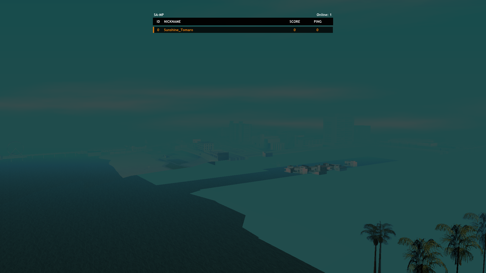

# Scoreboard - SA-MP Custom Scoreboard Plugin

A modern, customizable scoreboard replacement for San Andreas Multiplayer (SA-MP) using ImGui.



## Features

- Modern ImGui-based UI
- Double-click player to spectate
- Shows player ID, nickname, score, and ping
- Clean dark theme design
- Scrollable player list for large servers
- Press `TAB` to open, `ESC` or `TAB` to close

## Requirements

Before building or using this plugin, you need:

1. **Grand Theft Auto: San Andreas** (1.0 US version)
2. **SA-MP** (0.3.7 R1)
3. **ASI Loader** (like [Ultimate ASI Loader](https://github.com/ThirteenAG/Ultimate-ASI-Loader) or Silent's ASI Loader)

### For Building (Developers)

- **Windows 10/11**
- **Visual Studio 2019 or newer** with C++ workload
- **CMake 3.15 - 3.29** (CMake 4.x may have issues with FetchContent)
- **Git**

## Quick Start - For Users (Pre-built)

If you just want to use the plugin without building:

1. Download `Scoreboard.asi` from the [Releases](../../releases) page
2. Copy `Scoreboard.asi` to your GTA SA game folder
3. Make sure you have an ASI loader installed
4. Launch GTA SA and join any SA-MP server
5. Press `TAB` in-game to see the new scoreboard

## Building from Source

```bash
# 1. Configure
cmake -B build -S . -A Win32

# 2. Build
cmake --build build --config Release

# 3. Output is in output/Scoreboard.asi
```

### Troubleshooting Build

| Problem | Solution |
|---------|----------|
| "CMake not found" | Install CMake from https://cmake.org/download/ and check "Add to PATH" |
| "Visual Studio not found" | Install VS 2019+ with "Desktop development with C++" workload |
| "Git not found" | Install Git from https://git-scm.com/download/win |
| Build fails | Delete `build/` folder and try again |
| "Failed to clone repository" / CMake 4.x | Use CMake 3.29 or lower. CMake 4.x has FetchContent issues. Download from https://cmake.org/files/v3.29/ |
| Missing dependencies | Check that `cmake/` folder exists with `xbyak_CMakeLists.txt` |

## Installation

1. **Install GTA SA** - Make sure you have version 1.0 US
2. **Install SA-MP** - Download from https://sa-mp.com/
3. **Install ASI Loader** - Copy `dinput8.dll` or use an ASI loader of your choice to your GTA SA folder
4. **Install Scoreboard.asi** - Copy `Scoreboard.asi` to your GTA SA folder
5. **Launch the game** - Join a server and press TAB

## Controls

- `TAB` - Toggle scoreboard on/off
- `ESC` - Close scoreboard
- `Double-click player` - Spectate that player (if you have permissions)

## Project Structure

```
Scoreboard/
├── src/              # Source code
│   ├── main.cpp      # DLL entry point
│   ├── Plugin.cpp    # Main plugin logic
│   ├── PluginGUI.cpp # UI rendering (ImGui)
│   ├── PluginRPC.cpp # Network packet handling
│   └── ...
├── cmake/            # CMake patches
├── CMakeLists.txt    # Build configuration
└── output/           # Build output (created after build)
```

## Technical Details

- **Language**: C++20
- **UI Library**: ImGui (Docking branch)
- **Hooking**: kthook / PolyHook_2
- **SA-MP API**: sampapi
- **Rendering**: DirectX 9

## Credits

- **Author**: AnWu
- **UI**: Dear ImGui by ocornut
- **SA-MP API**: BlastHackNet
- **RakHook**: imring

## License

This project is licensed under the MIT License - see [LICENSE](LICENSE) file.

## Support

For issues or questions:
- Create an [Issue](../../issues)